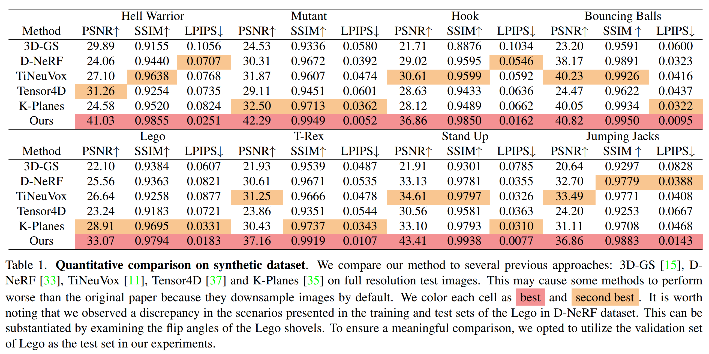

# Deformable 3D Gaussians for High-Fidelity Monocular Dynamic Scene Reconstruction

## [Project page](https://ingra14m.github.io/Deformable-Gaussians/) | [Paper](https://arxiv.org/abs/2309.13101)


This repository contains the official implementation associated with the paper "Deformable 3D Gaussians for High-Fidelity Monocular Dynamic Scene Reconstruction". We will release our code as soon as possible.


## News

- 23/10/25, update **real-time viewer** in project page. Many, many thanks to @[yihua7](https://github.com/yihua7) for implementing the real-time viewer adapted for Deformable-GS. Also, thanks to @[ashawkey](https://github.com/ashawkey) for releasing the original GUI. Full code will be **released on 11.17**.

## Dataset

In our paper, we use synthetic dataset from [D-NeRF](https://www.albertpumarola.com/research/D-NeRF/index.html) and real dataset from [Hyper-NeRF](https://hypernerf.github.io/). 

> I have identified an **inconsistency in the D-NeRF's Lego dataset**. Specifically, the scenes corresponding to the training set differ from those in the test set. This discrepancy can be verified by observing the angle of the flipped Lego shovel. To meaningfully evaluate the performance of our method on this dataset, I recommend using the **validation set of the Lego dataset** as the test set.


## Pipeline


## Run

### Environment

```shell
git clone https://github.com/ingra14m/Deformable-3D-Gaussians --recursive
cd Deformable-3D-Gaussians

conda env create --file environment.yml
conda activate deformable_gaussian_env
pip install imageio==2.27.0
pip install opencv-python
pip install imageio-ffmpeg
pip install scipy
pip install dearpygui
```


## Results

### D-NeRF Dataset

**Quantitative Results**



**Qualitative Results**

        

        

### HyperNeRF Dataset

The results of HyperNeRF dataset can be viewed on the [project page](https://ingra14m.github.io/Deformable-Gaussians/).


### Real-Time Viewer

https://github.com/ingra14m/Deformable-3D-Gaussians/assets/63096187/ec26d0b9-c126-4e23-b773-dcedcf386f36


## BibTex

```
@article{yang2023deformable3dgs,
    title={Deformable 3D Gaussians for High-Fidelity Monocular Dynamic Scene Reconstruction},
    author={Yang, Ziyi and Gao, Xinyu and Zhou, Wen and Jiao, Shaohui and Zhang, Yuqing and Jin, Xiaogang},
    journal={arXiv preprint arXiv:2309.13101},
    year={2023}
}
```

And thanks to the authors of [3D Gaussians](https://repo-sam.inria.fr/fungraph/3d-gaussian-splatting/) for their excellent code, please consider also cite this repository:

```
@Article{kerbl3Dgaussians,
      author       = {Kerbl, Bernhard and Kopanas, Georgios and Leimk{\"u}hler, Thomas and Drettakis, George},
      title        = {3D Gaussian Splatting for Real-Time Radiance Field Rendering},
      journal      = {ACM Transactions on Graphics},
      number       = {4},
      volume       = {42},
      month        = {July},
      year         = {2023},
      url          = {https://repo-sam.inria.fr/fungraph/3d-gaussian-splatting/}
}
```

