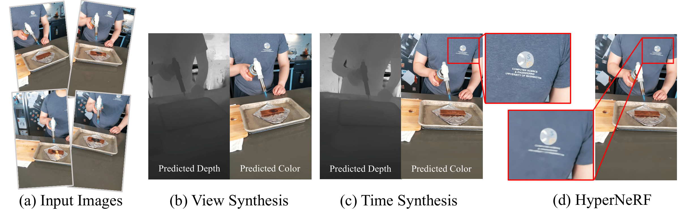
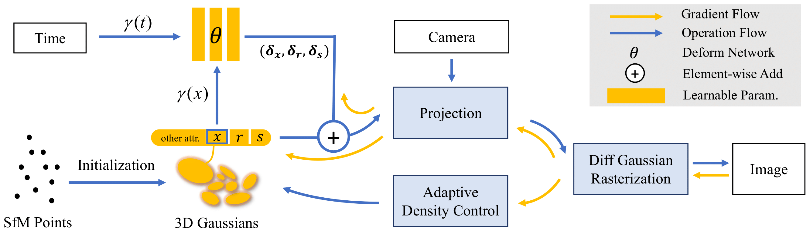
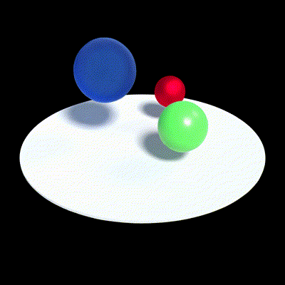
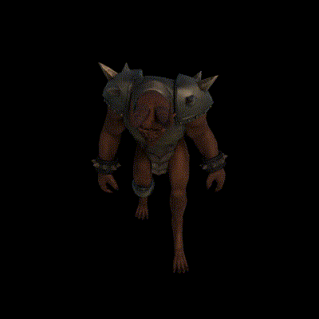
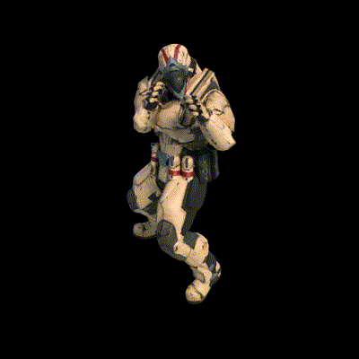
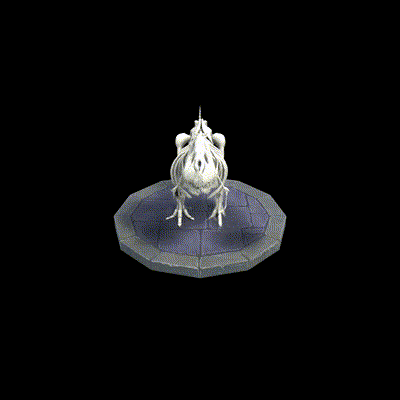
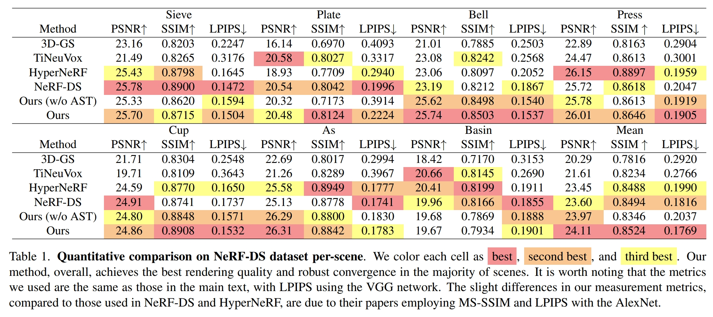

# Deformable 3D Gaussians for High-Fidelity Monocular Dynamic Scene Reconstruction

## [Project page](https://ingra14m.github.io/Deformable-Gaussians/) | [Paper](https://arxiv.org/abs/2309.13101)



This repository contains the official implementation associated with the paper "Deformable 3D Gaussians for High-Fidelity Monocular Dynamic Scene Reconstruction".


## News

- **[2/27/2024]** Deformable-GS is accepted by CVPR 2024. Our another work, [SC-GS](https://yihua7.github.io/SC-GS-web/) (with higher quality, less points and faster FPS than vanilla 3D-GS), is also accepted. See you in Seattle.
- **[11/16/2023]** Full code and real-time viewer released.
- **[11/4/2023]** update the computation of LPIPS in metrics.py. Previously, the `lpipsPyTorch` was unable to execute on CUDA, prompting us to switch to the `lpips` library (~20x faster).
- **[10/25/2023]** update **real-time viewer** on project page. Many, many thanks to @[yihua7](https://github.com/yihua7) for implementing the real-time viewer adapted for Deformable-GS. Also, thanks to @[ashawkey](https://github.com/ashawkey) for releasing the original GUI.


## Dataset

In our paper, we use:

- synthetic dataset from [D-NeRF](https://www.albertpumarola.com/research/D-NeRF/index.html).
- real-world dataset from [NeRF-DS](https://jokeryan.github.io/projects/nerf-ds/) and [Hyper-NeRF](https://hypernerf.github.io/).
- The dataset in the supplementary materials comes from [DeVRF](https://jia-wei-liu.github.io/DeVRF/).

We organize the datasets as follows:

```shell
├── data
│   | D-NeRF 
│     ├── hook
│     ├── standup 
│     ├── ...
│   | NeRF-DS
│     ├── as
│     ├── basin
│     ├── ...
│   | HyperNeRF
│     ├── interp
│     ├── misc
│     ├── vrig
```

> I have identified an **inconsistency in the D-NeRF's Lego dataset**. Specifically, the scenes corresponding to the training set differ from those in the test set. This discrepancy can be verified by observing the angle of the flipped Lego shovel. To meaningfully evaluate the performance of our method on this dataset, I recommend using the **validation set of the Lego dataset** as the test set. See more in [D-NeRF dataset used in Deformable-GS](https://github.com/ingra14m/Deformable-3D-Gaussians/releases/tag/v0.1-pre-released)


## Pipeline




## Run

### Environment

```shell
git clone https://github.com/ingra14m/Deformable-3D-Gaussians --recursive
cd Deformable-3D-Gaussians

conda create -n deformable_gaussian_env python=3.7
conda activate deformable_gaussian_env

# install pytorch
pip install torch==1.13.1+cu116 torchvision==0.14.1+cu116 --extra-index-url https://download.pytorch.org/whl/cu116

# install dependencies
pip install -r requirements.txt
```


### Train

**D-NeRF:**

```shell
python train.py -s path/to/your/d-nerf/dataset -m output/exp-name --eval --is_blender
```

**NeRF-DS/HyperNeRF:**

```shell
python train.py -s path/to/your/real-world/dataset -m output/exp-name --eval
```

**6DoF Transformation:**

We have also implemented the 6DoF transformation of 3D-GS, which may lead to an improvement in metrics but will reduce the speed of training and inference.

```shell
# D-NeRF
python train.py -s path/to/your/d-nerf/dataset -m output/exp-name --eval --is_blender --is_6dof

# NeRF-DS & HyperNeRF
python train.py -s path/to/your/real-world/dataset -m output/exp-name --eval --is_6dof
```

You can also **train with the GUI:**

```shell
python train_gui.py -s path/to/your/dataset -m output/exp-name --eval --is_blender
```

- click `start` to start training, and click `stop` to stop training.
- The GUI viewer is still under development, many buttons do not have corresponding functions currently. We plan to :
  - [ ] reload checkpoints from the pre-trained model.
  - [ ] Complete the functions of the other vacant buttons in the GUI.


### Render & Evaluation

```shell
python render.py -m output/exp-name --mode render
python metrics.py -m output/exp-name
```

We provide several modes for rendering:

- `render`: render all the test images
- `time`: time interpolation tasks for D-NeRF dataset
- `all`: time and view synthesis tasks for D-NeRF dataset
- `view`: view synthesis tasks for D-NeRF dataset
- `original`: time and view synthesis tasks for real-world dataset


## Results

### D-NeRF Dataset

**Quantitative Results**


**Qualitative Results**

        

        


### NeRF-DS Dataset



See more visualization on our [project page](https://ingra14m.github.io/Deformable-Gaussians/).


### HyperNeRF Dataset

Since the **camera pose** in HyperNeRF is less precise compared to NeRF-DS, we use HyperNeRF as a reference for partial visualization and the display of Failure Cases, but do not include it in the calculation of quantitative metrics. The results of the HyperNeRF dataset can be viewed on the [project page](https://ingra14m.github.io/Deformable-Gaussians/).


### Real-Time Viewer

https://github.com/ingra14m/Deformable-3D-Gaussians/assets/63096187/ec26d0b9-c126-4e23-b773-dcedcf386f36


## Acknowledgments

We sincerely thank the authors of [3D-GS](https://repo-sam.inria.fr/fungraph/3d-gaussian-splatting/), [D-NeRF](https://www.albertpumarola.com/research/D-NeRF/index.html), [HyperNeRF](https://hypernerf.github.io/), [NeRF-DS](https://jokeryan.github.io/projects/nerf-ds/), and [DeVRF](https://jia-wei-liu.github.io/DeVRF/), whose codes and datasets were used in our work. We thank [Zihao Wang](https://github.com/Alen-Wong) for the debugging in the early stage, preventing this work from sinking. We also thank the reviewers and AC for not being influenced by PR, and fairly evaluating our work. This work was mainly supported by ByteDance MMLab.


## BibTex

```
@article{yang2023deformable3dgs,
    title={Deformable 3D Gaussians for High-Fidelity Monocular Dynamic Scene Reconstruction},
    author={Yang, Ziyi and Gao, Xinyu and Zhou, Wen and Jiao, Shaohui and Zhang, Yuqing and Jin, Xiaogang},
    journal={arXiv preprint arXiv:2309.13101},
    year={2023}
}
```

And thanks to the authors of [3D Gaussians](https://repo-sam.inria.fr/fungraph/3d-gaussian-splatting/) for their excellent code, please consider also cite this repository:

```
@Article{kerbl3Dgaussians,
      author       = {Kerbl, Bernhard and Kopanas, Georgios and Leimk{\"u}hler, Thomas and Drettakis, George},
      title        = {3D Gaussian Splatting for Real-Time Radiance Field Rendering},
      journal      = {ACM Transactions on Graphics},
      number       = {4},
      volume       = {42},
      month        = {July},
      year         = {2023},
      url          = {https://repo-sam.inria.fr/fungraph/3d-gaussian-splatting/}
}
```

